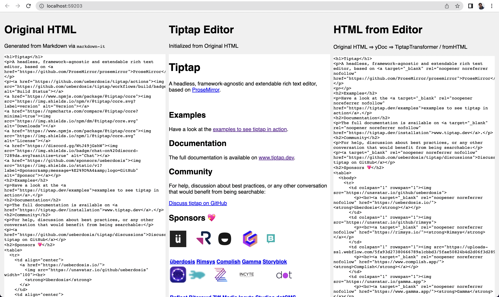

# Tiptap Bug: Broken Image Links

**Summary**: Links break while converting between HTML and yDoc using TiptapTransformer.

## Description

This repo shows how the document generated with Tiptap is different from the HTML used
to create the Ydoc/editor in the first place.

Just run `yarn start` and open the page to see the differences.



## Bug Details

Specifically, within the sponsors table there are links wrapping an image and text each,
however the generated HTML separates them so that only the text is linked.

The original HTML contains items like these:

```html
<a href="https://ueberdosis.io/">
    <br>
    <strong>überdosis</strong>
</a>
```

When this is loaded into the Tiptap editor you can already see that the image is not linked anymore.
Also, when creating a Ydoc from the original HTML, and converting that ydoc back to HTML
using <code>TiptapTransformer</code> and <code>generateHTML</code> the HTML is different:
```html

<p><br><a target="_blank" rel="noopener noreferrer nofollow"
          href="https://ueberdosis.io/"><strong>überdosis</strong></a></p>
```

## Bonus Questions

- how to ensure details like the width attribute on the img tags are not lost when converting?
